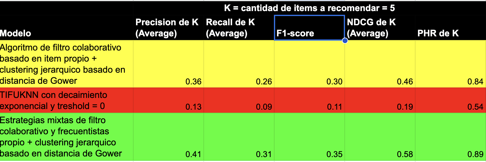
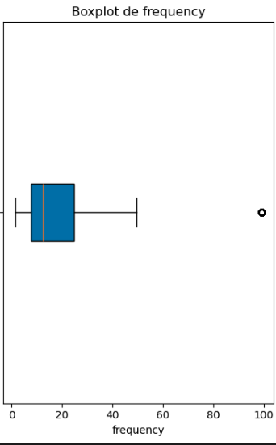
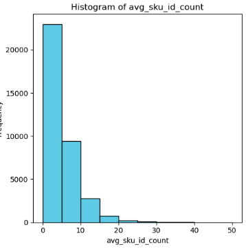

# challenge_AB_InBev

Este documento se ordena de la siguiente forma:

1. Introducción
2. Respuestas a las pretuntas planteadas en el challenge
3. Descripción del proceso realizado en el preprocesamiennto y EDA (preprocesssing_EDA.ipynb)
4. Framework de evaluación utilizado en los modelos
5. Explicación del algoritmo TIFUKNN
6. Deuda técnica
7. Futuros avances

## Introducción

Este es el desafío técnico que se le planteó a la cervecera AB InBev (https://www.abinbev.cl/) para el cual se desarrolló un preprocesamiento inicial y EDA, y 3 POC's de modelos de recomendación. El problema fue planteado como uno de predicción de la siguiente canasta en donde se debe ofrecer una canasta que balancee dos objetivos:

1. Desplegar recomendaciones que quepan en una pantalla de aplicación de desktop pero en especial móvil, que es donde más usan las aplicaciones en el canal tradicional, kioscos y minimarkets
2. Que el cliente encuentre productos que compra habitualmente (repetición)
3. Que el cliente descubra nuevos productos que no ha comprado hasta ahora (exploración)

Para escoger adecuadamente los algoritmos con los cuales se hicieron los prototipos, se recurrió a un análisis de dos papers recientes (2023) que compilan los resultados obtenidos hasta ahora por los distintos tipos de modelos y que proponen un marco de evaluación con métricas que nos permiten comprender el balance entre repetición y exploración en el cual nos encontramos. Los documentos se pueden encontrar en la carpeta: documents/bibliographic_review

## Respuestas a las pretuntas planteadas en el challenge

**Evaluación**

1. “EDA”. La idea de este punto es que integre los dataset compartidos, se plantee una hipótesis como por ejemplo “que variables me ayudarían a realizar predicciones” y como el Feature engineering podría mejorar la performance del modelo. Desarrolle algunas visualizaciones que fundamenten dichas hipótesis.

**Respuesta:** 

En el dataset de atributos se encontraron diferencias significativas en las variables de consumo de los clientes, así como en su relación con las categorías agregadas por el negocio que los caracterizaban. Es por ello que se utilizaron los datos de los atributos de los clientes para generar una segmentación mediante algoritmos no supervisados que permitieron obtener 6 segmentos bien diferenciados, los cuales fueron extremadamente útiles para mejorar los resultados de los algoritmos al permitir un grado extra en la personalización de la recomendación.

En cuanto a las transacciones, se investigó el comportamiento de compra en general y a lo largo del tiempo mirado desde el punto de vista de los clientes y también desde los items comprados, lo cual nos permitió determinar con qué frecuencia debemos entregar una recomendación (cada dos semanas) y el número de artículos a recomendar (5). También nos ayudó a entender qué tan recurrente son las compras y qué tan frecuente es que un cliente compre SKU distintos los que compra regularmente, lo que nos permitió tomar decisiones sobre el tipo de algoritmo que debíamos utilizar en los experimentos.

*La evidencia se puede revisar en el notebook preprocessing_EDA.ipynb*

2. “Data wrangling y modelado” desarrolle el preprocesing y modelado, justifique asunciones que tome durante el proceso, y el o los modelos 
elegidos.

**Respuesta:**

**Data wrangling**

- Sobre el dataset de atributos se hizo una eliminación de la columna NSE, pues su información ya estaba contenida en las otras variables categóricas que describían a los clientes. Para los valores nulos de concentración, segmento único y canal se hicieron imputaciones usando el algoritmo Random Forest para clasificación. El dataset de transacciones no tenía valores nulos.

- En ninguno de los dataset se encontraron valores fuera de rango y/o outliers relevantes que ameritaran algún tipo de tratamiento especial

- Se crearon dos dataset a partir de las transacciones:

1. *baskets* : Que es una agrupación por fecha(día)-usuario-orden que contiene 1 o mas sku y que contiene 1 o más cantidades pedidas de cada sku. Todos los artículos comprados en un solo día por un mismo cliente en una orden se considera una canasta. Estos datos se utilizaron posteriormente para hacer el análisis transaccional general en el EDA.

2. *temporal_transactions* : Calcula métricas sobre todas las transacciones realizadas para cada cliente y se usa para el análisis transaccional temporal en el EDA.

- Se creó una segmentación utilizando algoritmo *linkage* de clustering jerárquico basado en la distancia de Gower , con los cuales se generaron 6 segmentos que se agregaron a los datos transaccionales creando un nuevo dataset llamado transactions_cluster, el cual es el que se utiliza para aplicar los modelos que aplican filtros colaborativos basados en items. Este proceso implicó la eliminación de 389 clientes, equivalentes al 8.8% del total (4400)

**Modelado**

Se crearon periodos bisemanales que nos permiten agrupar las transacciones en dichos periodos, por lo que el concepto de canasta pasa a ser todo lo que se ha comprado durante esas dos semanas. La decisión está basada en un análisis de la frecuencia de compra de los clientes y un criterio de negocio basado en la experiencia personal que contiene los siguientes supuestos:

 - los comercios, especialmente el canal tradicional, kiosco y minimarquet al cual pertenece el 88% de los clientes no tiene una capacidad de almacenamiento para hacer compras grandes (mensuales por ejemplo) pero tampoco tiene un flujo suficiente que justifique compras muy recurrentes (diarias o semanales). De hecho, los datos de las transacciones nos muestran que el 75% hace 1 o ninguna compra semanal y que se llevan en promedio 3 sku por compra

 - La idea es no sobre stockear a los comercios y no consumirnos su liquidez, pues eso es malo para todos en el largo plazo ya que les resta capacidad de diversificar la ofeta de productos lo que termina reduciendo el flujo de clientes en el mediano y largo plazo (nadie va a minimarket donde solo hay cervezas). Por otro lado, el algortimo puede ir siendo adaptado para los clientes que tengan frecuencias distintas, esto puede ser especialmente relevante para clientes un canal distinto a los que conforman la mayoría en esta muestra (canal tradicional, kiosco y minimarquet)

Luego se realiza una división en datos de entrenamiento y prueba en base a este periodo bi-semanal. El último período se utiliza para test y el resto para entrenamiento, lo que implica que habrán comercios que estarán en el entrenamiento pero no necesariamente en el test, pues no compraron durante esas últimas dos semanas en las cuales se recopiló la muestra.

Luego se probaron 3 algoritmos sobre los datos de entrenameinto y test obtenidos previamente:

1. Algoritmo propio baso en filtro colaborativo basado en ítems (Item-based Collaborative Filtering) 

Calcula similitudes entre ítems comprados por usuarios que están en el mismo cluster y usa estas similitudes junto con el historial de compras del usuario para generar recomendaciones.
Los buenos resultados obtenidos con este algoritmo se deben, en nuestra opinión, a que se está aplicando un filtro colaborativo específico dentro de segmentos más pequeños y homogéneos, lo cual en este caso hace mucho sentido si se quiere balancear el sostener la compra actual (repetición) con proponer nuevos productos que podrían ser de interés para el cliente (exploración)

2. Adaptación del algoritmo TIFUKNN con función de decaimiento exponencial y K-means (k=5) como el mecanismo de determinación de vecinos cercanos para probar qué ocurría cuando usábamos un algoritmo con menos personalización que tiende a favorecer canastas de exploración.

*Es imporante notar que el código desarrollado para este algoritmo puede forzar el que se use el algoritmo solo sobre elementos del mismo cluster y se puede modificar la función de decaimiento exponencial para que sea más suave, sin embargo, por tiempo este experimento no se alcanzó a realizar pero ha quedado como parte de los próximos pasos*

3. Algoritmo propio con estrategias mixtas que usa 3 estrategias:

- Estrategia 1: Se seleccionan los ítems más frecuentes que son comunes tanto entre el usuario como en el clúster al que pertenece. Esto asegura que se recomienden productos populares que otros usuarios en el mismo clúster también están comprando.

- Estrategia 2: Después, se seleccionan los ítems más frecuentes que han sido comprados solo por el usuario, pero que no fueron incluidos en la primera estrategia. Esto permite personalizar aún más la recomendación, asegurando que también se tengan en cuenta las preferencias únicas del usuario.

- Estrategia 3: Si después de aplicar las dos primeras estrategias aún faltan ítems para completar la recomendación, se utiliza la estrategia del algoritmo TIFUKNN. Este algoritmo se encarga de llenar los espacios restantes basándose en la similitud entre productos, aprovechando la capacidad del modelo para identificar productos relacionados que el usuario aún no ha comprado pero que podrían interesarle.

El objetivo de usar este algoritmo es probar qué ocurre cuando favorecemos la repitición por sobre la exploración usando un algoritmo en donde podemos controlar cuántos elementos de lo recomendado viene de cada estrategia y con ello medir los cambios en performance asociado a este sesgo hacia recomendar lo que ya se compra de forma recurrente.

*Es importante notar que si bien el algoritmo dos no usa la columna de clusters, se aplicó sobre los mismos datos de entrenamiento y test para que los resultados fueran comparables*

3. Evalué el o los modelos desarrollados en distintos periodos, además, justifique las métricas que selecciono y el periodo de tiempo definido para la misma.

**Respuesta:** Hemos utilizado un conjunto de 5 métricas comunes y otras 5 métricas propuestas en el paper "A next basket recommendation reality check" para medir el desempeño de nuestros modelos. A continuación se presentan los resultados obtenidos.

Las métricas seleccionadas nos permiten obtener una visión completa sobre la performance general del modelo en cuanto a precisión y alcance, pero también nos permite entender cómo influye el que un algoritmo sea más o menos propenso a recomendar artículos repetidos por sobre ofrecer artículos de exploración. 

En este caso, la muestra entregada tiene un claro sesgo hacia la repitición, lo que queda demostrado al identificar que a medida que sube el ratio de repetición y baja el de exploración, también lo hacen todas las métricas generales y de repetición.Si por el contrario, aumentamos el ratio de exploración bajando el de repitición, los efectos en las métricas de exploración son más bien acotados.

Es bueno señalar que en un contexto teórico como este la medición de la exploración debe ser tomada con precaución, pues técnicamente nunca se ha ofrecido realmente ese producto y por lo tanto no podemos tener la certeza si el haber ejecutado esa acción hubiera cambiado el resultado de la canasta consumida en las últimas dos semanas para los clientes analizados. Debemos tener en cuenta que los sistemas de recomendación cambian los comportamiento de consumo de los usuarios.

Teniendo en cuenta lo dicho previamente, el modelo que a nuestro juicio balancea mejor la repetición con la exploración y además, en su estado actual, es lo suficientemente rápido en términos de tiempos de ejecución como para dejarlo en producción es el primer modelo: Algoritmo propio baso en filtro colaborativo basado en ítems (Item-based Collaborative Filtering). 

*Es importante notar que los parámetros utilizados en el modelo 3 fueron establecidos para que existiera una mayor tendencia a la repetición y es posible que ajustando dichos parámetros se logre una mejor performance que en el modelo 1. Sin embargo, este experimento ha quedado para futuros avances*

Como podemos observar 

4. “Output”: Defina cual es el output de su modelo. Que columnas va a tener. Para esta parte, va a tener que tomar 2 definiciones: 
    
    
    * ¿Cuántas recomendaciones de productos va a hacer para cada cliente? 

    **Respuesta:** 
    
    - se genera 1 recomendación cada dos semanas que contiene 5 SKU por recomendación. Los algoritmos propuestos no especifican la cantidad sugeridad de cada SKU, eso ha quedado para futuros avances.

    
    
    * ¿Cuál va a ser el criterio para definir esta cantidad?

    **Respuesta:**  
    
    - Se usa un periodo de dos semanas ya analizado en el total de transacciones el 50% los clientes compró cada 12 días o menos y analizado de forma bisemanal

    

    - Se entregan 5 SKU recomendados porque es un buen balance entre un número que se pueda desplegar fácilmente en una aplicación y que si se ve en móvil no requiera mucho *scroll down* y el patrón de consumo que ya tienen los usuarios. Del EDA sabemos que analizado de forma bisemanal, el 75% lleva 6 o menos SKU en promedio y analizado en el total de transacciones realizadas, el 50% compro 6 SKU o menos por compra.

    

## Descripción del proceso realizado en el preprocesamiennto y EDA (preprocesssing_EDA.ipynb)

A continuación describimos el proceso de lo realizado, especificando solo aquellos procesos que corresponden a lo que se utilizará finalmente en el entrenamiento e inferencia en producción. El resto de los resultados se puden encontrar documentados en los notebooks correspondientes.

### Preprocessing 

En los dataset de atributos y transacciones se ejecutan los siguientes análisis:
        * Calidad de los datos:
            * Revisar e imputar valores nulos cuando es necesario
            * Revisar valores fuera de rango y analizar posible impacto cuando es necesario
            * Cuantificar outliers y analizar posible impacto cuando es necesario
        * Transformaciones:
            * Se ejecutan algunas transformaciones de formato de fechas, números y textos
            * Se generan agregaciones para disponer de datasets que simplifiquen el EDA

### EDA -- Se contestan estas preguntas para tener una radiografía clara de mis clientes en base a su comportamiento de consumo y atributos entregados

El objetivo de este análisis es entender la magnitud del problema, las características del comportamiento transaccional y de los atributos asignados a los clientes. Uno de los aspectos más importantes en este análisis es entender la factibilidad de ejecutar algoritmos de clusterización para segmentar a los usuarios, así como también comprender si los primeros algoritmos que debemos usar en estas POC con frecuentistas, de filtro colaborativo , secuenciales , factorización de matrices, aprendizaje profundo y/o híbrido

**Sobre los clientes**

* **Análisis a la caracterización de los clientes**
    * ¿A cúantos clientes se les debe hacer recomendación? ¿Cuánto compran los clientes en cada compra? ¿Con qué frecuencia los clientes realizan compras?
    * Si los categorizo ¿Hay diferencias significativas en la distribución de clientes por categoría? ¿Las variables de consumo son distintas entre las categorías?  ¿Estas categorías son independientes entre si? 
  
* **Análisis transaccional general**
    * Con qué frecuencia
    * Cuántos productos se llevan en cada compra
    * Cuántos items de esos productos se llevan en cada compra
    * ¿Cómo varía la frecuencia de compra a lo largo del tiempo?

* **Análisis transaccional temporal**

    * ¿Existen clientes con comportamiento de compra repetitivo? ¿Quienes?
    * ¿Cuántas compras hicieron en el periodo analizado? ¿En qué rango se mueve?
    * ¿cuál es la frecuencia de compra en el periodo analizado?
    * Cuál es el tiempo desde la última compra
    * Qué antiguedad tienen y cómo se distribuye

* **Sobre los items**
    * ¿Cuál es la cantidad total de items disponibles para recomendación?
    * ¿Cuál es el ratio de items por cliente?
    * ¿Cuál es la cantidad de items promedio que cada cliente compra?
    * ¿Cuál es la proporción de items que se repiten al menos una vez del total de items comprados por usuario? ¿Cómo cambia a medida que bueno la cantidad de repeticiones

## Framework de evaluación utilizado en los modelos

**Consideraciones importantes al momento de leer los resultados:**

1. Estas métricas se calculan para cada una de las canastas predichas por usuario y luego los resultados reportados son el promedio obtenido sobre la muestra evaluada, 
a excepción del PHR de K, que si se hae como una proporción de los usuarios de la muestra

2. El F1 de K no fue utilizado de esa forma en el reporte final presentado en el Readme, sino que se ingresaron los promedios de Precisión y Recall de K 
como input de forma directa para calcularlo usando la siguiente fórmula:

F1 de K = 2 * (Precision de K promedio * Recall de K promedio)/(Precision de K promedio + Recall de K promedio)

3. En los notebooks con los experimentos, el que se muestra es el F1 de K promedio.

**Métricas comunes**

* Precision de K

- Definición: Mide la fracción de elementos relevantes entre las K principales recomendaciones.
- Cómo funciona: Para cada usuario, verifica cuántos de los K elementos recomendados se encuentran realmente en la próxima canasta del usuario.
- Interpretación: Una mayor precisión indica que una mayor proporción de los elementos recomendados son relevantes.

* Recall de K

- Definición: Mide la fracción de elementos relevantes en la canasta real que están presentes en las K principales recomendaciones.
- Cómo funciona: Para cada usuario, verifica cuántos de los elementos en la próxima canasta del usuario están entre los K elementos recomendados.
- Interpretación: Un mayor recall indica que una mayor proporción de la canasta del usuario es capturada por las recomendaciones.

* F1 de K 

- Definición: Es la media armónica de Precisión de K y Recall de K, proporcionando una única métrica que equilibra tanto la precisión como el recall.
- Cómo funciona: Combina tanto la precisión como el recall para dar una puntuación general de efectividad.
- Interpretación: Una mayor puntuación F1 indica un mejor equilibrio entre precisión y recall.

* Normalized Discounted Cumulative Gain (NDCG de K)

- Definición: Mide la calidad del ranking de las K principales recomendaciones, teniendo en cuenta el orden de los elementos.
- Cómo funciona: Evalúa la utilidad de un elemento según su posición en la lista de recomendaciones. Los elementos altamente relevantes que aparecen más arriba en la lista contribuyen más a la puntuación.
- Interpretación: NDCG@K varía de 0 a 1, donde 1 indica un ranking perfecto de los elementos.

* Personalized hit ratio (PHR)

- Definición: Mide la proporción de usuarios para los cuales al menos un elemento en las K principales recomendaciones está en la canasta real.
- Cómo funciona: Verifica si al menos un elemento en los K principales elementos recomendados coincide con un elemento en la próxima canasta del usuario.
- Interpretación: Un mayor PHR de K indica que las recomendaciones son generalmente más exitosas al incluir elementos relevantes.

**Métricas especiales propuestas en la literatura**

* Repetition Ratio (RepR)

* Exploration Ratio (ExplR)

* Recallrep

* Recallexp

* PHRrep

* PHRexpl

**Métricas especiales propuestas por mi**

* Precisión de K sobre n

- Definición: Esta es una versión modificada de Precisión de K, donde la precisión se calcula con un divisor personalizado n en lugar de K, en donde siempre se debe cumplir que n < K

- Cómo funciona: Ajusta el cálculo de precisión basado en un factor externo n, que podría usarse para ajustar la métrica según necesidades específicas del negocio. En simple, proporciona la posibilidad de definir un número esperado de aciertos reflejados en la variable *n* que puede estar asociado a una combinación de criterios de negocio, expectativas y/o análisis histórico

- Interpretación: Una mayor precisión indica un mayor cumplimiento del número esperado de aciertos del recomendador. En este caso dejamos n=3, pues es el valor de la mediana de SKU distintos que se llevan por canasta cuando se analizan periodos bisemanales (La evidencia se puede revisar en el notebook preprocessing_EDA.ipynb)

## Explicación del algoritmo TIFUKNN

FUKNN (Temporal Item-based Filtering Using K-Nearest Neighbors) es un algoritmo de recomendación basado en un enfoque de filtrado colaborativo. Se puede clasificar dentro de los algoritmos basados en K-Nearest Neighbors (KNN), que son utilizados comúnmente en sistemas de recomendación.

Características principales de TIFUKNN:

- Filtrado Colaborativo: Es un tipo de filtrado colaborativo basado en ítems. TIFUKNN utiliza la similitud entre ítems para hacer recomendaciones, considerando las interacciones pasadas de los usuarios.

- Temporalidad: Una de las características clave de TIFUKNN es la incorporación de una función de decaimiento temporal. Esto significa que el algoritmo da mayor peso a las interacciones recientes en comparación con las más antiguas, lo que permite capturar mejor las preferencias actuales de los usuarios.

- K-Nearest Neighbors (KNN): Utiliza el concepto de K-Nearest Neighbors para encontrar los ítems más similares en función de un conjunto de características. En este caso, la similitud entre ítems se calcula con base en las interacciones de los usuarios.

- Recomendación de cestas: TIFUKNN es particularmente útil para la recomendación de cestas (next-basket recommendation), donde se busca predecir el conjunto de productos que un usuario es probable que compre en su próxima visita.

En resumen, TIFUKNN es un algoritmo de recomendación basado en ítems que incorpora aspectos temporales y utiliza la metodología KNN para identificar ítems similares, con el objetivo de recomendar el siguiente conjunto de productos o cestas a un usuario.

## Deuda técnica

* Generar una mayor desagregación de los procesos que se ejecutan en las funciones que ejecutan los algoritmos de recomendación. 
    - Ejemplo: Separar las 3 estrategias mixtas y luego unir resultados.

* Mejorar la performance de los algoritmos, especialmente el de estrategias mixtas, mediante: 
    - La ejecución de operaciones vectoriales
    - Uso de librería polars 
    - Paralelización de la ejecución de procesos

* Implementar ML Flow o Neptune para generar trazabilidad y reproducibilidad de los experimentos realizados

+ Implementar Docker y la capacidad de ejecución automática en cualquier ambiente

* Implementar Dagster para la orquestación de procesos

* Es necesario homologar a inglés los docstring de las funciones

## Futuros avances

* Hacer análisis de cohort

* Incorporar las variables del análisis transaccional temporal como features asociados a los clientes que permitan segmentarlos mejor

* Se podrían examinar en mayor detalle los clientes que quedaron fuera de la muestra de transacciones porque no están en el dataset de atributos. El objetivo sería entender si es que hay algún sesgo asociado (por ejemplo, clientes de baja frecuencia o monto de compras y/o cantidad de SKU o productos por compra) 

* Ejecutar una optimización de parámetros en todos los algoritmos

* Usar un algoritmo de solo frecuencia para generar una linea base y como mecanismos de *fallback* ante contingencias

* Mejorar la función de decaimiento para el segundo algoritmo 